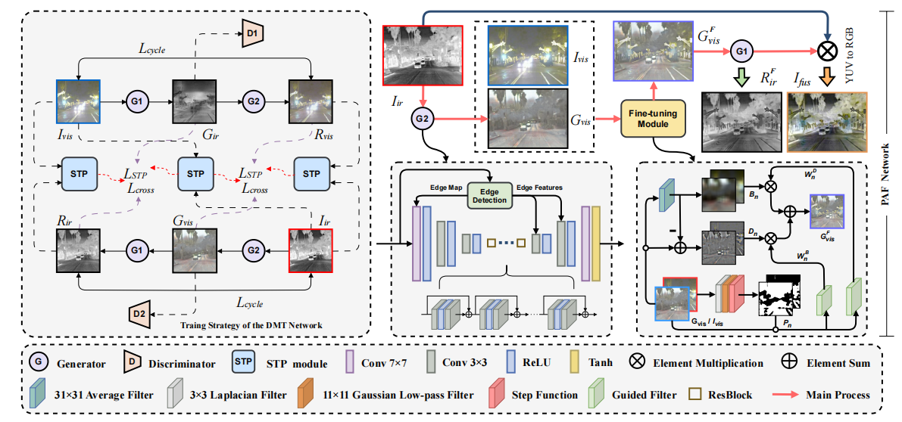

# CASPFuse
 CASPFuse: An Infrared and Visible Image Fusion Method based on Dual-cycle Crosswise Awareness and Global Structure-tensor Preservation


```python
    ## testing
       python test.py 

## Citation
```
@InProceedings{Wang_2022_IJCAI,
	author = {Di, Wang and Jinyuan, Liu and Xin, Fan and Risheng Liu},
	title = {Unsupervised Misaligned Infrared and Visible Image Fusion via Cross-Modality Image Generation and Registration},
	booktitle = {International Joint Conference on Artificial Intelligence (IJCAI)},
	year = {2022}
}
```

## Citation
```
@InProceedings{Li_2024_CVPR,
    author    = {Li, Xuan and Chen, Rongfu and Wang, Jie and Ma, Lei and Cheng, Li and Yuan, Haiwen},
    title     = {DSTCFuse: A Method based on Dual-cycled Cross-awareness of Structure Tensor for Semantic Segmentation via Infrared and Visible Image Fusion},
    booktitle = {Proceedings of the IEEE/CVF Conference on Computer Vision and Pattern Recognition (CVPR) Workshops},
    month     = {June},
    year      = {2024},
    pages     = {5558-5567}
}
```
